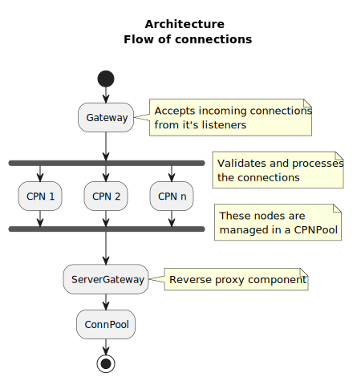

# Architecture

Infrared consists of a collection of proxies. Each proxy consists of four abstract components:
- A Gateway that manages a collection of network listeners (TCP and/or UDP)
- A Connection Processing Node Pool (CPNPool) that consists of a configurable amount of concurrent workers that process connections
- A Server Gateway that maps processed connections to the backend servers. This is the part of Infrared that handle the reverse proxy logic.
- A Connection Pool (ConnPool) that starts the proxy for all connections that could be mapped by the Server Gateway.

```plantuml
@startuml architecture
title <b>Architecture</b>\nFlow of connections\n
start
:Gateway;
note right: Accepts incoming connections\nfrom it's listeners
fork
  :CPN 1;
fork again
  :CPN 2;
fork again
  :CPN n;
end fork
note right: Validates and processes\nthe connections
note right: These nodes are\nmanaged in a CPNPool
:ServerGateway;
note right: Reverse proxy component
:ConnPool;
stop
@enduml
```

  

